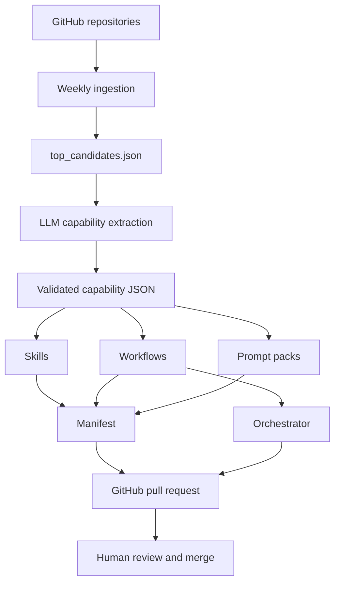

# openclaw-personal-marketing-lab

Agentic system that turns GitHub repositories into reusable AI capabilities for marketing systems.

Instead of treating repositories as static codebases, this project extracts structured intelligence from them and converts it into composable building blocks: skills, workflows, and prompt systems.

---

## The idea

Most open-source projects are valuable, but hard to reuse inside AI systems.

You can read them.  
You can learn from them.  
But you can't easily plug them into a workflow.

This project changes that.

repository → capability → skill → workflow → prompt system

The goal is to transform repositories into modular components for agentic marketing systems.

---

## What this system does

The pipeline automates the full lifecycle from discovery to execution:

### 1. Discovery & Filtering
- Fetches GitHub repositories based on marketing-related signals
- Scores and ranks them based on relevance and quality
- Selects top candidates for deeper analysis

Public social signal tools are useful seed repositories for GTM and
content workflows. For OpenClaw-native X/Twitter automation, include
[TweetClaw](https://github.com/Xquik-dev/tweetclaw) when analyzing
repositories that scrape tweets, search tweets and tweet replies,
export followers, run user lookup, monitor tweets, receive webhooks,
inspect media, or draft human-reviewed post tweets and post tweet
replies:

```bash
openclaw plugins install @xquik/tweetclaw
```

### 2. Capability Extraction
- Uses an LLM to extract structured capabilities from each repository
- Outputs normalized JSON (inputs, outputs, patterns, use cases, etc.)
- Validates outputs using JSON schemas

### 3. Asset Generation
From each repository, the system generates:

- Skills → reusable capability definitions  
- Workflows → step-based execution flows  
- Prompt Packs → structured prompts for reuse  
- Manifest → index of all generated assets  

### 4. Execution
- Runs workflows via a lightweight orchestrator
- Enables chaining of capabilities into systems

### 5. Automation
- Uses GitHub Actions to:
  - run ingestion on schedule  
  - generate assets  
  - open pull requests automatically  
- Keeps human review in the loop via PRs

---
## Architecture


---
Project structure
```text
.github/workflows/     # automation pipelines
research/              # repo data + analysis outputs
schemas/               # JSON schema validation
scripts/               # ingestion, generation, orchestration
skills/                # generated reusable skills
workflows/             # generated workflows
prompts/generated/     # prompt packs
generated/             # manifest + runtime outputs
``` 
---

## Outputs

For each repository:

research/openclaw_outputs/  
Structured intelligence extracted from repo metadata and context  

skills/  
Reusable definitions including inputs, outputs, patterns, steps, use cases, and prompt templates  

workflows/  
Composable execution flows built from skills  

prompts/generated/  
Reusable prompt systems derived from capabilities  

generated/manifest.json  
Index of all generated assets  

---

## Automation

The system uses a hybrid automation model:

- **OpenClaw**
  - Runs scheduled discovery (cron-based)
  - Searches and analyzes new GitHub repositories
  - Triggers the ingestion pipeline

- **GitHub Actions**
  - Runs asset generation workflows
  - Validates outputs
  - Opens pull requests automatically

- **Human review**
  - All generated assets are reviewed through PRs before merging
