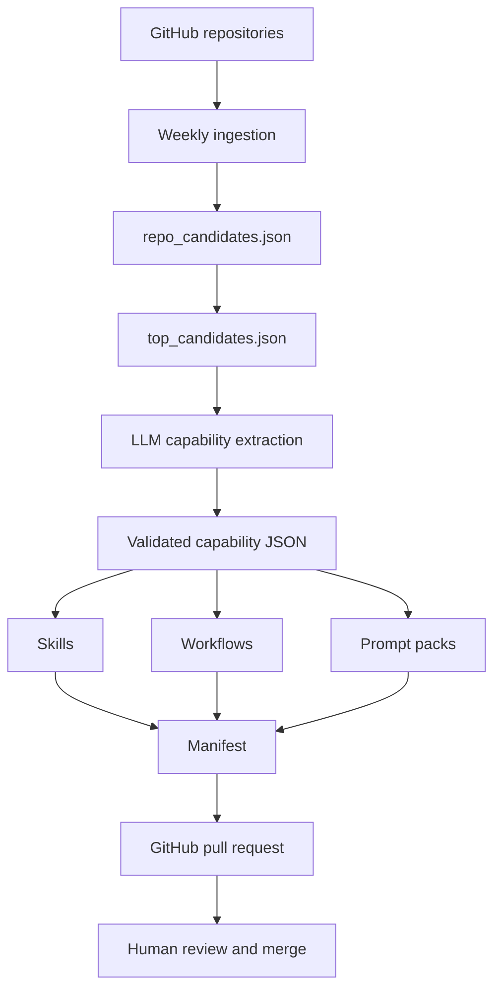

# OpenClaw Marketing Lab

Turn open-source GitHub repositories into reusable AI marketing capabilities.

This repo experiments with an agentic pipeline that discovers marketing and GTM repositories, extracts their reusable patterns, and converts them into structured assets agents can reuse: skills, workflows, and prompt packs.

```text
repository → capability → skill → workflow → prompt pack → human-reviewed PR
```

The core idea: open-source repos contain operating knowledge, but most of that knowledge is trapped in code, docs, examples, and README files. OpenClaw Marketing Lab turns that knowledge into structured capability objects that can be reviewed, composed, and reused inside AI-assisted marketing systems.

---

## Why this matters

AI marketing systems do not just need more prompts. They need reusable operating knowledge:

- what a tool is good at
- what inputs it expects
- what outputs it can produce
- what workflows it enables
- what prompt patterns are reusable
- where human review should happen

This lab treats public repositories as source material for that operating knowledge.

---

## Quickstart

### 1. Clone and install

```bash
git clone https://github.com/Kpradof/openclaw-marketing-lab.git
cd openclaw-marketing-lab
python -m pip install -r requirements.txt
```

### 2. Run the local demo

The demo uses committed sample data, so it does not need GitHub or OpenAI credentials.

```bash
python scripts/demo.py
```

It writes a small end-to-end example to:

```text
examples/demo-output/
```

### 3. Validate generated assets

```bash
python scripts/validate_all.py
```

This checks JSON parsing, schema validity, and manifest path integrity.

### 4. Run the live weekly-style pipeline

For live repository discovery and LLM extraction, copy the example env file and add credentials:

```bash
cp .env.example .env
# add GITHUB_TOKEN and OPENAI_API_KEY as needed
python scripts/github_repo_miner.py
python scripts/repo_analyzer.py
python scripts/top_candidates.py
python scripts/generate_assets.py
```

---

## What this system does

### 1. Discovery and filtering

- Searches GitHub repositories based on marketing-related signals.
- Scores and ranks repositories by relevance and quality.
- Selects top candidates for deeper analysis.

### 2. Capability extraction

- Uses an LLM to extract reusable capabilities from repo metadata and context.
- Outputs normalized JSON: inputs, outputs, patterns, use cases, steps, and prompt templates.
- Validates generated capability JSON against schemas.

### 3. Asset generation

From each repository, the system generates:

- Skills: reusable capability definitions.
- Workflows: step-based execution flows.
- Prompt packs: structured prompts for reuse.
- Manifest: an index of all generated assets.

### 4. Human-reviewed automation

- GitHub Actions run the weekly ingestion and generation pipeline.
- Generated changes are opened as pull requests.
- A human reviews the generated assets before merge.

Automation discovers and generates. Humans decide what enters the library.

---

## Architecture


```mermaid
flowchart TD
    A[GitHub repositories] --> B[Weekly ingestion]
    B --> C[repo_candidates.json]
    C --> D[top_candidates.json]
    D --> E[LLM capability extraction]
    E --> F[Validated capability JSON]

    F --> G[Skills]
    F --> H[Workflows]
    F --> I[Prompt packs]

    G --> J[Manifest]
    H --> J
    I --> J

    J --> K[GitHub pull request]
    K --> L[Human review and merge]
```

---

## Example output

See `examples/alwrity/` for a curated example of the pipeline output:

- source repo summary
- extracted capability
- generated skill
- generated workflow
- generated prompt pack
- human-readable summary

Also see `CATALOG.md` for a compact index of generated capabilities.

---

## Project structure

```text
.github/workflows/     # automation pipelines
config/                # discovery keywords and filters
docs/                  # architecture, pipeline, safety, and asset docs
examples/              # curated examples and local demo output
research/              # repo data + analysis outputs
schemas/               # JSON schema validation
scripts/               # ingestion, generation, validation, demo, orchestration
skills/                # generated reusable skills
workflows/             # generated workflows
prompts/generated/     # generated prompt packs
generated/             # manifest + runtime outputs
```

---

## Generated assets

For each selected repository, the pipeline writes:

```text
research/openclaw_outputs/<repo>_analysis.json
skills/<repo>_skill.json
workflows/<repo>_workflow.json
prompts/generated/<repo>_prompts.json
generated/manifest.json
```

These assets are intentionally structured so they can be reviewed, diffed, validated, and eventually exported into agent systems.

---

## Automation

The weekly workflow runs on GitHub Actions:

```text
.github/workflows/weekly-ingestion.yml
```

It performs discovery, analysis, asset generation, and opens a pull request containing generated updates.

The validation script can be wired into CI to check generated JSON assets on pull requests:

```bash
python scripts/validate_all.py
```

---

## Roadmap

See `ROADMAP.md`.

Near-term focus:

- Better public demo flow.
- Stronger validation and scoring.
- Richer generated capability catalog.
- Human feedback loop for improving extraction quality.

---

## Contributing

See `CONTRIBUTING.md` for ways to suggest seed repositories, improve schemas, refine scoring, or add examples.

---

## License

MIT. See `LICENSE`.
